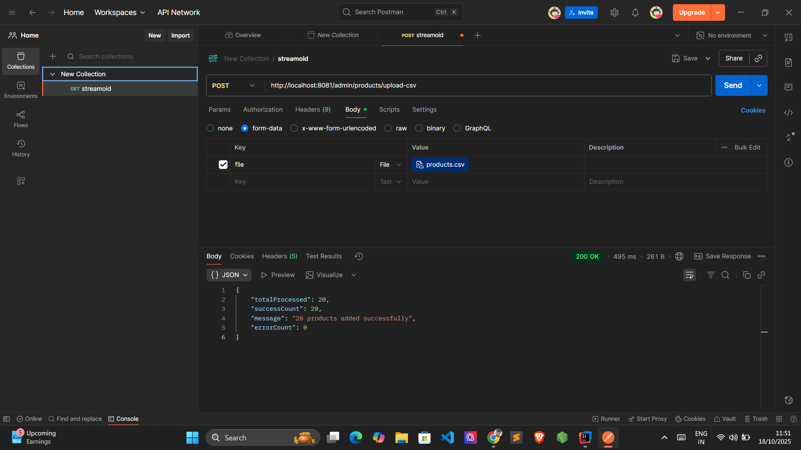
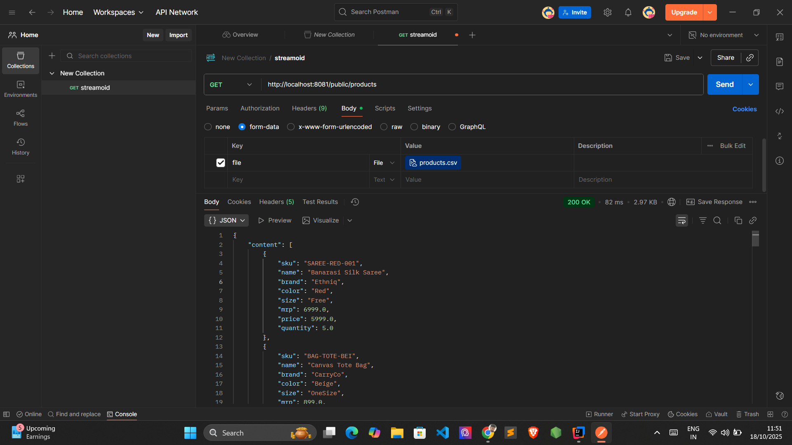
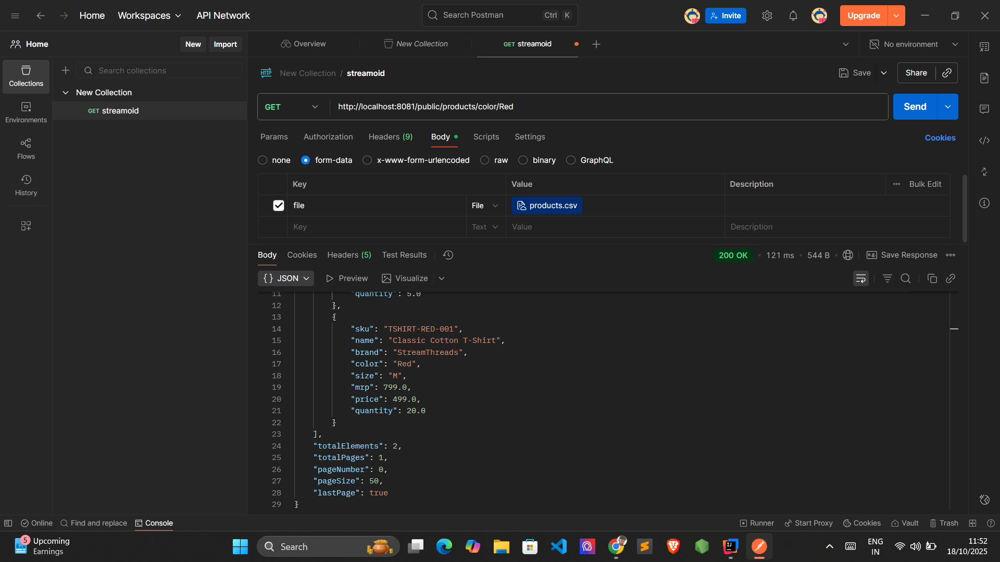
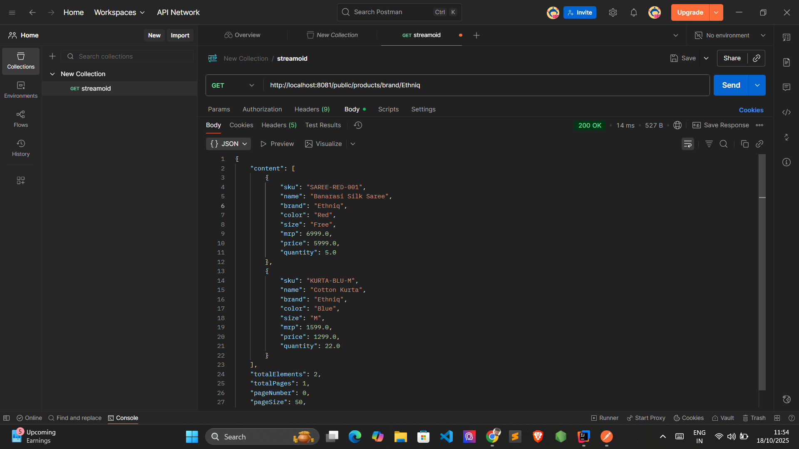
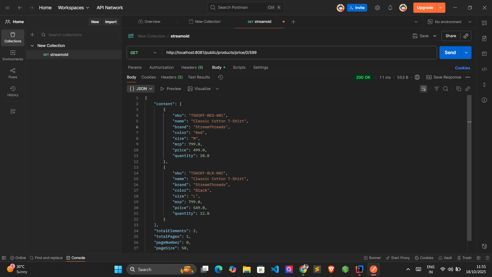

# Product API Documentation

A Spring Boot REST API for managing and retrieving product information with support for CSV uploads, filtering, sorting, and pagination.

## Table of Contents
- [Features](#features)
- [Technologies Used](#technologies-used)
- [Setup Instructions](#setup-instructions)
- [API Endpoints](#api-endpoints)
- [Testing Guide](#testing-guide)
- [Sample Requests and Responses](#sample-requests-and-responses)

---

## Features

- Upload products via CSV file
- Retrieve all products
- Filter products by color
- Filter products by brand
- Filter products by price range

---

## Technologies Used

- **Java** (Spring Boot)
- **Spring Web MVC**
- **Multipart File Upload**

---

## Setup Instructions

### Prerequisites

- Java 11 or higher
- Maven 3.6+
- IDE (IntelliJ IDEA, Eclipse, or VS Code)

### Installation Steps

1. **Clone the repository**
   ```bash
   git clone <repository-url>
   cd <project-directory>
   ```

2. **Configure application properties**

   Update `application.properties` or `application.yml` with your database and server configurations.

3. **Build the project**
   ```bash
   mvn clean install
   ```

4. **Run the application**
   ```bash
   mvn spring-boot:run
   ```

5. **Access the API**

   The API will be available at: `http://localhost:8081`

---

## API Endpoints

### Base URL
```
http://localhost:8081
```

### 1. Upload Products from CSV

**Endpoint:** `POST /admin/products/upload-csv`

**Description:** Upload a CSV file containing product data to bulk import products.

**Request Type:** `multipart/form-data`

**Parameters:**
- `file` (required): CSV file containing product data

**Success Response:**
- **Code:** 200 OK
- **Content:**
  ```json
  {
    "message": "Products uploaded successfully",
    "count": 50
  }
  ```

**Error Response:**
- **Code:** 400 BAD REQUEST / 500 INTERNAL SERVER ERROR
- **Content:**
  ```json
  {
    "error": "Error message details"
  }
  ```

---

### 2. Get All Products

**Endpoint:** `GET /public/products`

**Description:** Retrieve all products.

**Sample Request:**
```
GET http://localhost:8081/public/products
```

**Success Response:**
- **Code:** 200 OK
- **Content:**
  ```json
  {
    "content": [
      {
        "productId": 1,
        "productName": "Product Name",
        "brand": "Brand Name",
        "color": "Red",
        "price": 99.99
      }
    ]
  }
  ```

---

### 3. Get Products by Color

**Endpoint:** `GET /public/products/color/{color}`

**Description:** Retrieve all products filtered by a specific color.

**Path Parameters:**
- `color` (required): Color to filter by (e.g., Red, Blue, Black)

**Sample Request:**
```
GET http://localhost:8081/public/products/color/Red
```

**Success Response:**
- **Code:** 200 OK
- **Content:** Same structure as Get All Products

---

### 4. Get Products by Brand

**Endpoint:** `GET /public/products/brand/{brand}`

**Description:** Retrieve all products filtered by a specific brand.

**Path Parameters:**
- `brand` (required): Brand name to filter by

**Sample Request:**
```
GET http://localhost:8081/public/products/brand/Nike
```

**Success Response:**
- **Code:** 200 OK
- **Content:** Same structure as Get All Products

---

### 5. Get Products by Price Range

**Endpoint:** `GET /public/products/price/{minPrice}/{maxPrice}`

**Description:** Retrieve all products within a specified price range.

**Path Parameters:**
- `minPrice` (required): Minimum price
- `maxPrice` (required): Maximum price

**Sample Request:**
```
GET http://localhost:8080/public/products/price/50/500
```

**Success Response:**
- **Code:** 200 OK
- **Content:** Same structure as Get All Products

---

## Testing Guide

### Using Postman

1. **Install Postman** from [https://www.postman.com/downloads/](https://www.postman.com/downloads/)

2. **Import the API endpoints** or create them manually

3. **Test each endpoint** following the examples below

### Using cURL

#### Test POST - Upload CSV
```bash
curl -X POST http://localhost:8081/admin/products/upload-csv 
  -F "file=@/path/to/products.csv"
```

#### Test GET - All Products
```bash
curl -X GET "http://localhost:8081/public/products"
```

#### Test GET - Products by Color
```bash
curl -X GET "http://localhost:8081/public/products/color/Red"
```

#### Test GET - Products by Brand
```bash
curl -X GET "http://localhost:8081/public/products/brand/Nike"
```

#### Test GET - Products by Price Range
```bash
curl -X GET "http://localhost:8081/public/products/price/50.0/500.0"
```

---

## Sample Requests and Responses

### 1. POST - Upload Products from CSV




---

### 2. GET - All Products



---

### 3. GET - Products by Color



---

### 4. GET - Products by Brand



---

### 5. GET - Products by Price Range



---

## CSV File Format

The CSV file for product upload should have the following format:

```csv
productName,brand,color,price,description
Product 1,Nike,Red,99.99,Description here
Product 2,Adidas,Blue,89.99,Description here
```

---

## Error Handling

All endpoints return appropriate HTTP status codes:

- `200 OK` - Successful request
- `400 BAD REQUEST` - Invalid input or parameters
- `404 NOT FOUND` - Resource not found
- `500 INTERNAL SERVER ERROR` - Server error

Error responses follow this format:
```json
{
  "error": "Detailed error message"
}
```

---

## Notes

- Make sure to create a `screenshots` folder in the same directory as this README
- Replace placeholder screenshot paths with actual screenshots after testing
- Price range endpoints accept decimal values

---

## Contributing

1. Fork the repository
2. Create your feature branch
3. Commit your changes
4. Push to the branch
5. Create a Pull Request

---
